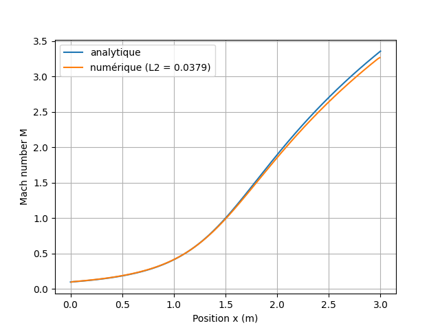
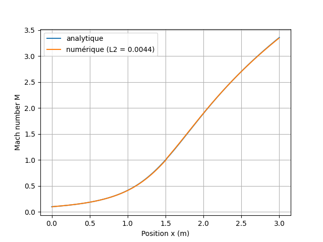

# 1D Compressible Euler Solver — Rusanov vs HLLC on a Laval Nozzle

> A finite-volume solver for the quasi-1D compressible Euler equations,
> written in modern C++, contrasting two Riemann-based flux schemes —
> **Rusanov** and **HLLC** — on a converging–diverging (de Laval) nozzle.

---

##  Overview

This project solves the quasi-one-dimensional compressible Euler equations
in a de Laval nozzle using a cell-centred finite-volume method, and
contrasts two interface flux schemes:

- **Rusanov**:Extremely robust, but diffusive — it smears contact discontinuities
  and shocks over several cells.
- **HLLC**: a three-wave approximate Riemann solver that restores the
  **contact wave** ignored by the HLL family. It resolves shocks and
  contact discontinuities, requires no entropy fix.

---

## Physics and Governing Equations

### Conservative form

In conservative form, the quasi-1D Euler equations read

$$\frac{\partial \mathbf{U}}{\partial t} + \frac{\partial \mathbf{F}(\mathbf{U})}{\partial x} = \mathbf{S}(\mathbf{U}),$$


with the conservative state vector, the physical flux,
and the geometric source term

$$\mathbf{U} = \begin{pmatrix}\rho ,\\ \rho u ,\\ E\end{pmatrix},\quad
\mathbf{F} = \begin{pmatrix}\rho u ,\\ \rho u^2 + p ,\\ u(E+p)\end{pmatrix},\quad
\mathbf{S} = \begin{pmatrix}0 ,\\ \dfrac{p}{A}\dfrac{dA}{dx} ,\\ 0\end{pmatrix},$$

closed by the ideal-gas equation of state

$$p = (\gamma - 1)\left(E - \tfrac{1}{2}\rho u^2\right),$$

where $A(x)$ is the local nozzle cross-sectional area. The convective
flux is handled by the chosen Riemann solver; the area source term is
treated as an explicit right-hand-side contribution, applied separately
in the time update step.

### Nozzle geometry

The test case follows the Anderson (1995) convergent–divergent nozzle:

$$A(x) = 1 + 2.2(x - 1.5)^2, \qquad x \in [0,\, 3].$$

The throat is located at $x = 1.5$, where $A^* = 1$.

### Boundary conditions

| Boundary        | Condition                                                        |
|-----------------|------------------------------------------------------------------|
| Subsonic inlet  | Total conditions fixed: $P_0 = 101\,325$ Pa, $T_0 = 300$ K, $M = 0.1$ |
| Supersonic outlet | Zero-gradient extrapolation — all three characteristics exit the domain |

The sonic condition $M = 1$ at the throat is **not imposed** but emerges
naturally from the solution, confirming the physical consistency of the solver.

### Analytical reference

The isentropic area–Mach relation provides the exact solution for
a fully supersonic diverging section:

$$\frac{A}{A^*} = \frac{1}{M}
\left[\frac{2}{\gamma+1}
\left(1 + \frac{\gamma-1}{2}M^2\right)\right]^{\frac{\gamma+1}{2(\gamma-1)}}.$$

---

## Numerical Method

### Flux schemes

**Rusanov.** The interface flux uses the single fastest wave speed
$S_{\max}$ as a uniform dissipation coefficient:

$$\mathbf{F}^{\text{Rus}}_{i+1/2} = \tfrac{1}{2}\left(\mathbf{F}_L + \mathbf{F}_R\right)- \tfrac{1}{2}S_{\max}\left(\mathbf{U}_R - \mathbf{U}_L\right),
  \qquad
  S_{\max} = \max\big(|u_L|+c_L,\ |u_R|+c_R\big).$$

**HLLC.** The Riemann fan is approximated by three waves of speeds
$S_L$, $S^*$, $S_R$ — estimates of the eigenvalues
$u-c$, $u$, $u+c$ of the flux Jacobian $\partial\mathbf{F}/\partial\mathbf{U}$.
The interface flux is selected by sampling the fan at $x/t = 0$; in
the star regions it is built from the intermediate state via the
Rankine–Hugoniot jump:

$$\mathbf{F}^{\star}_K
= \mathbf{F}_K + S_K\left(\mathbf{U}^{\star}_K - \mathbf{U}_K\right),
\qquad K \in \{L,\, R\}.$$

The contact-wave speed $S_*$ is obtained from momentum conservation:

$$S^* = \frac{p_R - p_L + \rho_L u_L(S_L - u_L) - \rho_R u_R(S_R - u_R)} {\rho_L(S_L - u_L) - \rho_R(S_R - u_R)},$$


### Time integration

Time advancement uses an explicit first-order Euler scheme, constrained
by the CFL stability condition:

$$\mathrm{Co}
= \frac{(|u|+c)\,\Delta t}{\Delta x} \leq 1.$$

A Courant number of $\mathrm{Co}_{\max} = 0.5$ is used as a good margin — 
the theoretical limit of 1 holds for linear advection, but the nonlinearity 
of Euler means the wave speed can be underestimated during a step.

---

## Software Architecture

The solver is organised around four classes with clearly separated
responsibilities.

| Class              | Responsibility                                                                                                                                        |
|--------------------|-------------------------------------------------------------------------------------------------------------------------------------------------------|
| `StateVector`      | Conservative state `(ρ, ρu, ρE)` with overloaded vector-space operators (`+`, `−`, scalar `*`), and physical accessors `getPressure()`, `getSoundSpeed()`, `getFluidVelocity()`. |
| `Cellule`          | A single finite-volume cell: holds a `StateVector`, computes the physical flux `getFlux()`, and provides the primitives needed by the Riemann solver. |
| `Domaine`          | Builds the 1D nozzle domain — allocates the cell array, sets the nozzle geometry $A(x)$, applies boundary conditions, enforces the CFL time step, and drives the simulation through the `run()` function. |
| `NumericalSchemes` | Stateless interface-flux functions `getRusanov()` and `getHLLC()`, callable interchangeably on any pair of adjacent cells.                            |

### Design note: operator-overloaded StateVector

Overloading the vector-space operators on `StateVector` allows the
numerics to mirror the mathematics directly. The Rankine–Hugoniot
star flux, for example, reduces to a single readable line:

```cpp
// F*_K = F_K + S_K (U*_K - U_K)
StateVector F_star = F_k + S_k * (U_star - U_k);
```
---
## Results and Validation


###  Validation Against the Isentropic Area–Mach Relation

To check whether the solver gives physically correct numbers, the
computed Mach profile is compared against the exact isentropic
area–Mach relation. The L2 norm measures the overall gap between
the numerical and analytical curves.

**Rusanov — L2 = 0.0379**



Rusanov does well in the low-Mach region, but the gap with the
analytical solution grows as the Mach number increases. At the
nozzle exit, the numerical profile reaches M ≈ 3.2 instead of
the analytical M = 3.35 — a 1.5% error. The numerical diffusion
of the scheme is directly responsible: it softens the supersonic
gradients and slightly underestimates the exit Mach.

**HLLC — L2 = 0.0044**



With HLLC, the numerical curve is nearly on top of the analytical
one across the whole nozzle, including the high-Mach supersonic
region where Rusanov starts to drift. The exit Mach number matches
the analytical value to within less than 0.1%.

### Summary

| Metric                   | Rusanov        | HLLC           |
|--------------------------|:--------------:|:--------------:|
| L2 error — Mach profile  | 0.0379         | **0.0044**     |
| Exit Mach (numerical)    | ≈ 3.20         | ≈ 3.35         |
| Exit Mach error          | 1.5 %          | < 0.1 %        |
| Shock sharpness          | Several cells  | 1–2 cells      |

HLLC is **8.6× more accurate** than Rusanov on the same mesh, at a
small extra cost per interface. For this kind of supersonic nozzle
flow, the improvement is well worth it.
--- 
## Project Structure

```
├── CMakeLists.txt
├── main.cpp
├── src/
│   ├── StateVector.h          # conservative state with operator overloading
│   ├── Cellule.h / .cpp       # finite-volume cell
│   ├── Domaine.h  / .cpp      # domain, geometry, time loop
│   └── NumericalSchemes.h / .cpp  # Rusanov and HLLC flux functions
├── scripts/
│   ├── Validation.py          # Mach profile vs analytical solution
│   └── GifCreation.py         # animated flow field visualisation
├── results/
│   ├── Validation_HLLC/
│   └── Validation_RUSANOV/
└── README.md
```
---
## Build and Run

**Requirements:** C++17 compiler, CMake ≥ 3.16

```bash
git clone https://github.com/mathis-tpan/HLLC-vs-Rusanov-Laval-Nozzle.git
cd HLLC-vs-Rusanov-Laval-Nozzle
mkdir build && cd build
cmake ..
make
./main
```

The project can also be opened directly in CLion or any
CMake-compatible IDE.

To switch between Rusanov and HLLC, edit one line in `domaine.cpp`:

```cpp
NumericalSchemes::getHLLC(tuyere[i], tuyere[i+1], gamma);  // or getRusanov
```
---
## Author & Context

Developed by **Mathis Toppan**, first-year engineering student at
IMT Mines Albi (France).

This project was entirely self-initiated alongside the first-year
curriculum. All infrastructure — solver architecture, meshing,
numerical schemes, and validation — was independently designed
and implemented on a personal workstation.

Long-term goal: contributing to research in computational fluid
dynamics at institutions such as the von Karman Institute (VKI) or ONERA.

---
## References

- Anderson, J.D. (1995). *Computational Fluid Dynamics: The Basics with Applications*. McGraw-Hill.
- Toro, E.F. (2009). *Riemann Solvers and Numerical Methods for Fluid Dynamics*. Springer.

